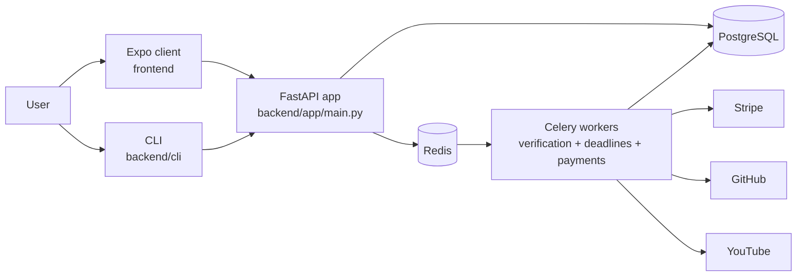
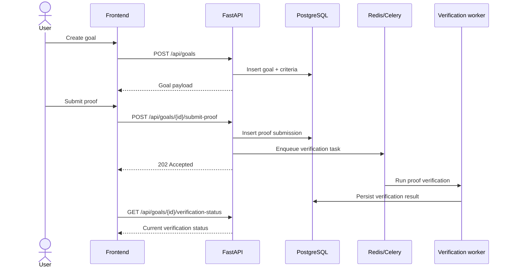

# Architecture Diagrams

## System flow

```mermaid
flowchart LR
    User[User]
    CLI[CLI\nbackend/cli]
    FE[Expo client\nfrontend]
    API[FastAPI app\nbackend/app/main.py]
    DB[(PostgreSQL)]
    Redis[(Redis)]
    Celery[Celery workers\nverification + deadlines + payments]
    Stripe[Stripe]
    GitHub[GitHub]
    YouTube[YouTube]

    User --> FE
    User --> CLI
    FE --> API
    CLI --> API
    API --> DB
    API --> Redis
    Redis --> Celery
    Celery --> DB
    Celery --> Stripe
    Celery --> GitHub
    Celery --> YouTube
```

## Primary goal flow

```mermaid
sequenceDiagram
    actor User
    participant FE as Frontend
    participant API as FastAPI
    participant DB as PostgreSQL
    participant Q as Redis/Celery
    participant W as Verification worker

    User->>FE: Create goal
    FE->>API: POST /api/goals
    API->>DB: Insert goal + criteria
    API-->>FE: Goal payload

    User->>FE: Submit proof
    FE->>API: POST /api/goals/{id}/submit-proof
    API->>DB: Insert proof submission
    API->>Q: Enqueue verification task
    API-->>FE: 202 Accepted

    Q->>W: Run proof verification
    W->>DB: Persist verification result
    FE->>API: GET /api/goals/{id}/verification-status
    API-->>FE: Current verification status
```
