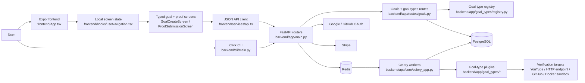
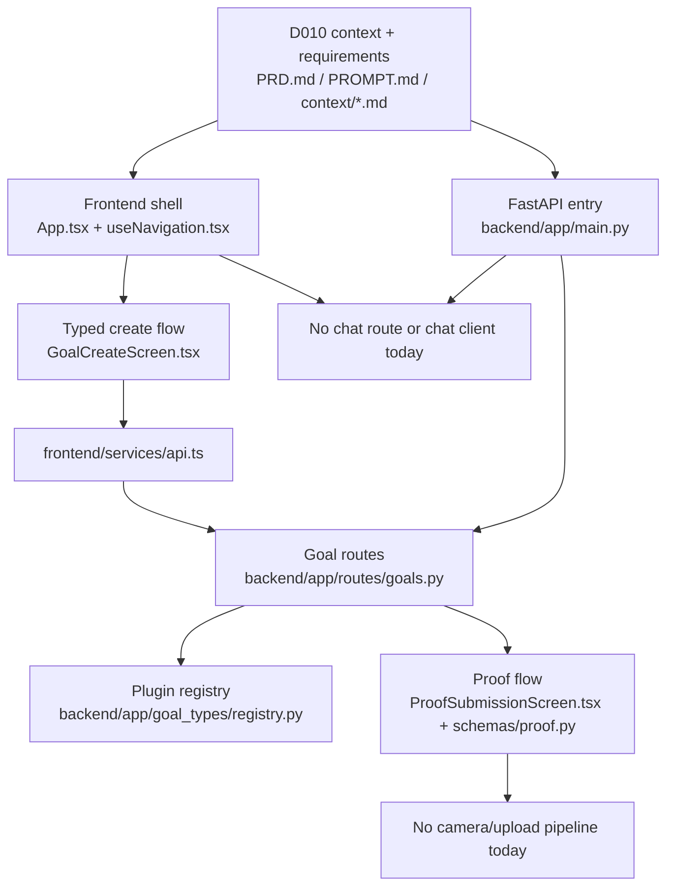
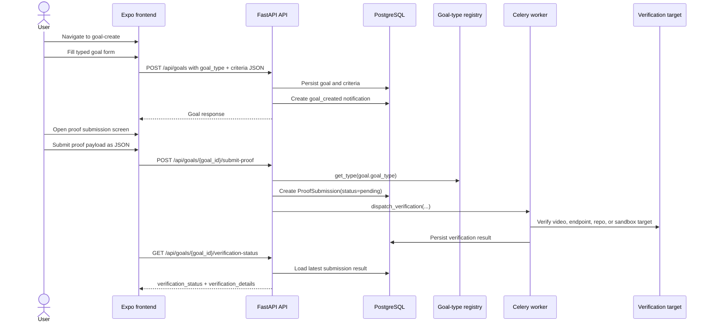

# Architecture Diagrams

## Current implemented system flow

## Current D010 boundary: where a chat-factory flow would have to attach

## Primary user flow today: create a goal, submit proof, await verification

