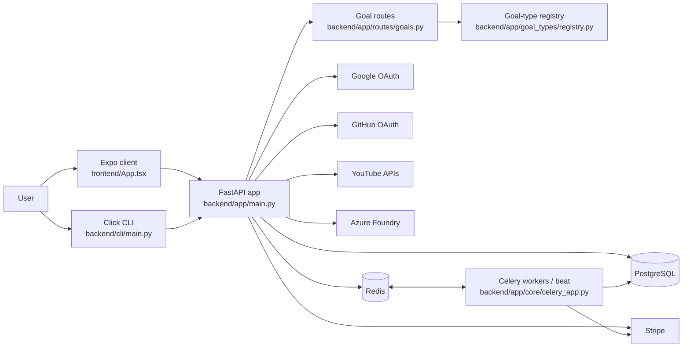
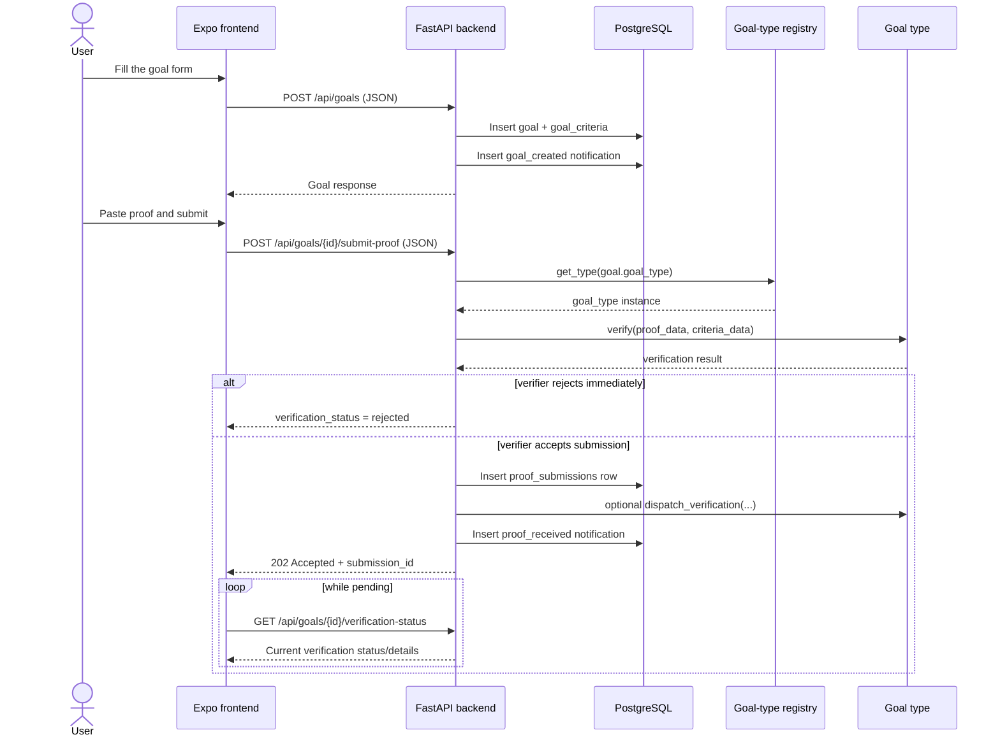

# Architecture Diagrams

## System flow

```mermaid
flowchart LR
  U[User] --> FE[Expo client\nfrontend/App.tsx]
  U --> CLI[Click CLI\nbackend/cli/main.py]

  FE --> API[FastAPI app\nbackend/app/main.py]
  CLI --> API

  API --> GOALS[Goal routes\nbackend/app/routes/goals.py]
  GOALS --> REG[Goal-type registry\nbackend/app/goal_types/registry.py]
  API --> PG[(PostgreSQL)]
  API --> STRIPE[Stripe]
  API --> GOOGLE[Google OAuth]
  API --> GITHUB[GitHub OAuth]
  API --> YT[YouTube APIs]
  API --> AZURE[Azure Foundry]
  API --> REDIS[(Redis)]
  REDIS <--> CELERY[Celery workers / beat\nbackend/app/core/celery_app.py]
  CELERY --> PG
  CELERY --> STRIPE
```

## Primary user flow: create a goal, then submit proof

```mermaid
sequenceDiagram
  actor User
  participant FE as Expo frontend
  participant API as FastAPI backend
  participant DB as PostgreSQL
  participant REG as Goal-type registry
  participant GT as Goal type

  User->>FE: Fill the goal form
  FE->>API: POST /api/goals (JSON)
  API->>DB: Insert goal + goal_criteria
  API->>DB: Insert goal_created notification
  API-->>FE: Goal response

  User->>FE: Paste proof and submit
  FE->>API: POST /api/goals/{id}/submit-proof (JSON)
  API->>REG: get_type(goal.goal_type)
  REG-->>API: goal_type instance
  API->>GT: verify(proof_data, criteria_data)
  GT-->>API: verification result

  alt verifier rejects immediately
    API-->>FE: verification_status = rejected
  else verifier accepts submission
    API->>DB: Insert proof_submissions row
    API->>GT: optional dispatch_verification(...)
    API->>DB: Insert proof_received notification
    API-->>FE: 202 Accepted + submission_id
    loop while pending
      FE->>API: GET /api/goals/{id}/verification-status
      API-->>FE: Current verification status/details
    end
  end
```
