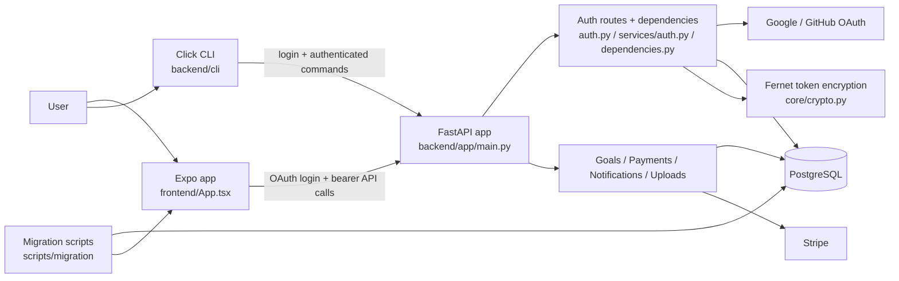

# Architecture Diagrams

## System flow



## Primary auth flow

```mermaid
sequenceDiagram
    participant U as User
    participant A as Expo app / LoginScreen
    participant B as FastAPI auth routes
    participant O as OAuth provider
    participant D as PostgreSQL

    U->>A: Tap Google or GitHub sign-in
    A->>B: GET /api/auth/{provider}/login?redirect_uri=sacrifice://...
    B-->>A: 302 to provider + set oauth_state cookie
    A->>O: Open provider auth page
    O-->>B: Callback with code + state
    B->>B: Verify oauth_state and callback state
    B->>D: Find or create user; store pending auth code
    B-->>A: 302 back to app with one-time auth_code
    A->>B: POST /api/auth/exchange { code }
    B->>D: Consume pending code and rotate active session id
    B-->>A: access_token + user payload
    A->>A: Store bearer locally and attach it on API calls
```
