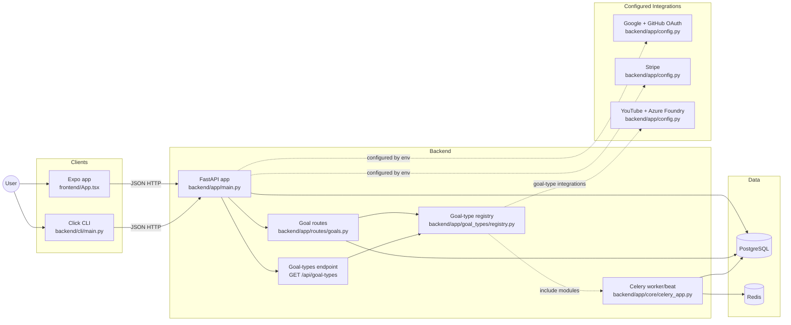
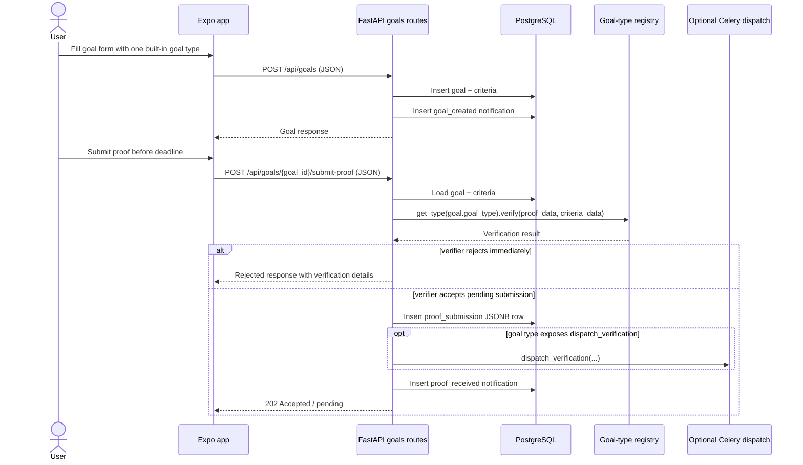

# Architecture diagrams

## System flow



## Primary user flow



## Chat → factory goal-type generation flow (D009/D010)

When a user's prompt matches no existing goal type, Sacrifice can commission a
new one from the factory and activate the user's goal once it merges.

```mermaid
sequenceDiagram
    participant User
    participant App
    participant Chat as Chat API (chat.py)
    participant Match as chat_match service
    participant Synth as direction_synth service
    participant Vol as directions volume (bind-mount)
    participant Factory as factory chain (external)
    participant DB

    User->>App: Describe goal in chat
    App->>Chat: POST /api/chat/sessions/{id}/messages
    Chat->>Match: match_message(prompt, catalog)
    alt match >= threshold
        Match-->>Chat: match_proposed(goal_type, missing_criteria)
        Chat-->>App: assistant card "Use this goal type"
        Note over App,Chat: conversational criteria fill → ready_to_create
        App->>Chat: POST .../create-goal {goal_payload}
        Chat->>DB: create goal (active)
    else no match
        Match-->>Chat: no_match
        Chat-->>App: card "Build a new goal type?"
        User->>App: "Yes, build it"
        App->>Chat: POST .../request-new-goal-type
        Chat->>Synth: synthesize_direction(chat_history)
        Synth->>Vol: write direction.md (+flow/api_spec)
        Chat->>DB: create goal (awaiting_goal_type, awaiting_direction_id)
        Chat-->>App: 202 {direction_id, goal_id, status: queued}
    end

    Factory->>Vol: pick up direction, run chain
    Note over Factory: queued → in_progress → pr_open → pr_merged

    loop App polls
        App->>Chat: GET .../generation-status
        Chat->>Vol: read direction state.yaml
        Chat-->>App: coarse status
    end

    Factory->>Vol: direction state → pr_merged
    Chat->>DB: fire goal_type_ready notification (idempotent)
    User->>App: tap notification
    alt accept
        App->>Chat: POST .../accept-generated-type
        Chat->>DB: goal awaiting_goal_type → active; clear awaiting_direction_id
    else iterate
        App->>Chat: POST .../iterate-generated-type {feedback}
        Chat->>Synth: synthesize child direction (parent_direction linkage)
        Note over Chat,Factory: new direction runs; goal stays awaiting_goal_type until accept
    end
```
