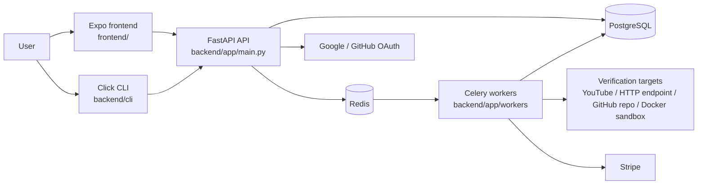
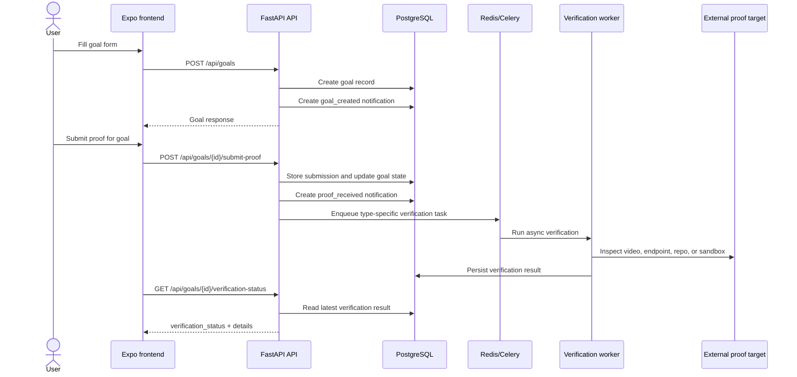

# Architecture Diagrams

## System flow

```mermaid
flowchart LR
    user[User]
    frontend[Expo frontend\nfrontend/]
    cli[Click CLI\nbackend/cli]
    api[FastAPI API\nbackend/app/main.py]
    db[(PostgreSQL)]
    redis[(Redis)]
    workers[Celery workers\nbackend/app/workers]
    oauth[Google / GitHub OAuth]
    verify[Verification targets\nYouTube / HTTP endpoint / GitHub repo / Docker sandbox]
    stripe[Stripe]

    user --> frontend
    user --> cli
    frontend --> api
    cli --> api
    api --> db
    api --> redis
    redis --> workers
    workers --> db
    api --> oauth
    workers --> verify
    workers --> stripe
```

## Primary user flow: create a goal, submit proof, await verification

```mermaid
sequenceDiagram
    actor User
    participant Frontend as Expo frontend
    participant API as FastAPI API
    participant DB as PostgreSQL
    participant Queue as Redis/Celery
    participant Worker as Verification worker
    participant External as External proof target

    User->>Frontend: Fill goal form
    Frontend->>API: POST /api/goals
    API->>DB: Create goal record
    API->>DB: Create goal_created notification
    API-->>Frontend: Goal response

    User->>Frontend: Submit proof for goal
    Frontend->>API: POST /api/goals/{id}/submit-proof
    API->>DB: Store submission and update goal state
    API->>DB: Create proof_received notification
    API->>Queue: Enqueue type-specific verification task
    Queue->>Worker: Run async verification
    Worker->>External: Inspect video, endpoint, repo, or sandbox
    Worker->>DB: Persist verification result

    Frontend->>API: GET /api/goals/{id}/verification-status
    API->>DB: Read latest verification result
    API-->>Frontend: verification_status + details
```
