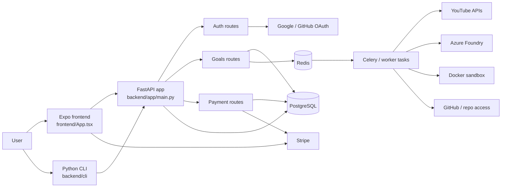
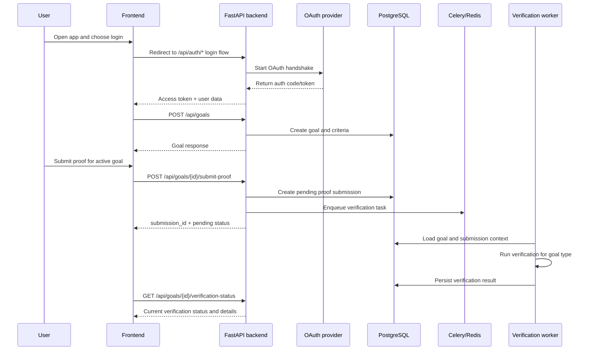

# Architecture diagrams

## System flow

```mermaid
flowchart LR
    User[User]
    Frontend[Expo frontend\nfrontend/App.tsx]
    CLI[Python CLI\nbackend/cli]
    API[FastAPI app\nbackend/app/main.py]
    Auth[Auth routes]
    Goals[Goals routes]
    Payments[Payment routes]
    DB[(PostgreSQL)]
    Redis[(Redis)]
    Worker[Celery / worker tasks]
    Docker[Docker sandbox]
    Stripe[Stripe]
    YouTube[YouTube APIs]
    Azure[Azure Foundry]
    GitHub[GitHub / repo access]
    OAuth[Google / GitHub OAuth]

    User --> Frontend
    User --> CLI
    Frontend --> API
    CLI --> API

    API --> Auth
    API --> Goals
    API --> Payments

    Auth --> OAuth
    Goals --> DB
    Payments --> DB
    API --> DB
    Goals --> Redis
    Redis --> Worker

    Worker --> YouTube
    Worker --> Azure
    Worker --> Docker
    Worker --> GitHub
    Payments --> Stripe
    Frontend --> Stripe
```

## Primary user flow

```mermaid
sequenceDiagram
    participant U as User
    participant F as Frontend
    participant B as FastAPI backend
    participant O as OAuth provider
    participant D as PostgreSQL
    participant Q as Celery/Redis
    participant W as Verification worker

    U->>F: Open app and choose login
    F->>B: Redirect to /api/auth/* login flow
    B->>O: Start OAuth handshake
    O-->>B: Return auth code/token
    B-->>F: Access token + user data
    F->>B: POST /api/goals
    B->>D: Create goal and criteria
    B-->>F: Goal response
    U->>F: Submit proof for active goal
    F->>B: POST /api/goals/{id}/submit-proof
    B->>D: Create pending proof submission
    B->>Q: Enqueue verification task
    B-->>F: submission_id + pending status
    W->>D: Load goal and submission context
    W->>W: Run verification for goal type
    W->>D: Persist verification result
    F->>B: GET /api/goals/{id}/verification-status
    B-->>F: Current verification status and details
```
